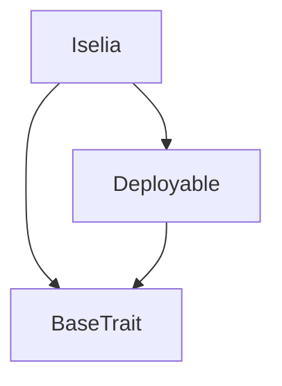
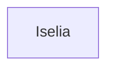

# TACT Compilation Report
Contract: Iselia
BOC Size: 1920 bytes

# Types
Total Types: 18

## StateInit
TLB: `_ code:^cell data:^cell = StateInit`
Signature: `StateInit{code:^cell,data:^cell}`

## StdAddress
TLB: `_ workchain:int8 address:uint256 = StdAddress`
Signature: `StdAddress{workchain:int8,address:uint256}`

## VarAddress
TLB: `_ workchain:int32 address:^slice = VarAddress`
Signature: `VarAddress{workchain:int32,address:^slice}`

## Context
TLB: `_ bounced:bool sender:address value:int257 raw:^slice = Context`
Signature: `Context{bounced:bool,sender:address,value:int257,raw:^slice}`

## SendParameters
TLB: `_ bounce:bool to:address value:int257 mode:int257 body:Maybe ^cell code:Maybe ^cell data:Maybe ^cell = SendParameters`
Signature: `SendParameters{bounce:bool,to:address,value:int257,mode:int257,body:Maybe ^cell,code:Maybe ^cell,data:Maybe ^cell}`

## Deploy
TLB: `deploy#946a98b6 queryId:uint64 = Deploy`
Signature: `Deploy{queryId:uint64}`

## DeployOk
TLB: `deploy_ok#aff90f57 queryId:uint64 = DeployOk`
Signature: `DeployOk{queryId:uint64}`

## FactoryDeploy
TLB: `factory_deploy#6d0ff13b queryId:uint64 cashback:address = FactoryDeploy`
Signature: `FactoryDeploy{queryId:uint64,cashback:address}`

## BuySpin
TLB: `buy_spin#cf5e5439 amount:coins = BuySpin`
Signature: `BuySpin{amount:coins}`

## ChangeAdmin
TLB: `change_admin#25f3df7e newOwner:address = ChangeAdmin`
Signature: `ChangeAdmin{newOwner:address}`

## ClaimWinnings
TLB: `claim_winnings#3c5291b4 amount:coins to:address = ClaimWinnings`
Signature: `ClaimWinnings{amount:coins,to:address}`

## TransferReward
TLB: `transfer_reward#a7d3c20e amount:int257 to:address = TransferReward`
Signature: `TransferReward{amount:int257,to:address}`

## Withdraw
TLB: `withdraw#aa3e544e amount:coins recipient:address = Withdraw`
Signature: `Withdraw{amount:coins,recipient:address}`

## TransferEvent
TLB: `transfer_event#2e0f251b amount:coins recipient:address = TransferEvent`
Signature: `TransferEvent{amount:coins,recipient:address}`

## SpinBuyEvent
TLB: `spin_buy_event#93e16d80 amount:coins sender:address = SpinBuyEvent`
Signature: `SpinBuyEvent{amount:coins,sender:address}`

## TokenTransfer
TLB: `token_transfer#0f8a7ea5 query_id:int257 jetton_amount:int257 to:address responseAddress:address customPayload:^cell forward_ton_amount:int257 forwardPayload:^cell = TokenTransfer`
Signature: `TokenTransfer{query_id:int257,jetton_amount:int257,to:address,responseAddress:address,customPayload:^cell,forward_ton_amount:int257,forwardPayload:^cell}`

## TokenNotification
TLB: `token_notification#7362d09c queryId:uint64 amount:coins from:address forward_payload:remainder<slice> = TokenNotification`
Signature: `TokenNotification{queryId:uint64,amount:coins,from:address,forward_payload:remainder<slice>}`

## Iselia$Data
TLB: `null`
Signature: `null`

# Get Methods
Total Get Methods: 2

## contractBalance

## adminAddress

# Error Codes
2: Stack underflow
3: Stack overflow
4: Integer overflow
5: Integer out of expected range
6: Invalid opcode
7: Type check error
8: Cell overflow
9: Cell underflow
10: Dictionary error
11: 'Unknown' error
12: Fatal error
13: Out of gas error
14: Virtualization error
32: Action list is invalid
33: Action list is too long
34: Action is invalid or not supported
35: Invalid source address in outbound message
36: Invalid destination address in outbound message
37: Not enough TON
38: Not enough extra-currencies
39: Outbound message does not fit into a cell after rewriting
40: Cannot process a message
41: Library reference is null
42: Library change action error
43: Exceeded maximum number of cells in the library or the maximum depth of the Merkle tree
50: Account state size exceeded limits
128: Null reference exception
129: Invalid serialization prefix
130: Invalid incoming message
131: Constraints error
132: Access denied
133: Contract stopped
134: Invalid argument
135: Code of a contract was not found
136: Invalid address
137: Masterchain support is not enabled for this contract
54615: Insufficient balance
62026: You're not authorized to make this function call

# Trait Inheritance Diagram

# Contract Dependency Diagram

